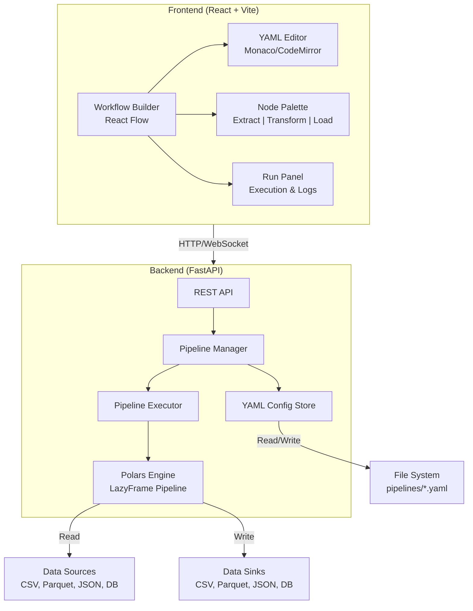

# Poloom — Implementation Plan

> **Poloom** (*Polars* + *Loom* — weaving data paths visually): A configurable ETL studio powered by **Python Polars** with YAML-based pipeline definitions, a **FastAPI** backend for execution, and a **React + React Flow** frontend for visual workflow building.

---

## Architecture Overview



---

## Design Decisions (Resolved)

| Decision | Choice |
|----------|--------|
| **Frontend** | React + Vite + React Flow + Monaco Editor |
| **Backend** | FastAPI + Polars + PyYAML + Pydantic |
| **Monorepo** | `backend/` and `frontend/` in the same repo |
| **Database** | SQLite via aiosqlite (pipelines + run history) |
| **Data Sources (v1)** | CSV, JSON, Parquet file sources and sinks |
| **Authentication** | None for v1 (local/dev use) |

---

## YAML Pipeline Schema

This is the core contract between the frontend editor and the backend executor:

```yaml
pipeline:
  name: customer_data_flow
  description: "Clean and aggregate customer data"
  version: "1.0"

stages:
  - id: extract_csv
    type: extract
    source: csv
    extract_config:
      path: "./data/customers.csv"
      separator: ","
      has_header: true
      dtypes:
        id: Int64
        name: Utf8
        revenue: Float64

  - id: filter_active
    type: transform
    operation: filter
    depends_on: [extract_csv]
    transform_config:
      conditions:
        - field: status
          operator: eq
          value: active

  - id: aggregate_revenue
    type: transform
    operation: group_by
    depends_on: [filter_active]
    transform_config:
      group_by: [region]
      aggregations:
        - column: revenue
          function: sum
          alias: total_revenue
        - column: id
          function: count
          alias: customer_count

  - id: load_parquet
    type: load
    sink: parquet
    depends_on: [aggregate_revenue]
    load_config:
      path: "./output/revenue_by_region.parquet"
      compression: snappy
```

---

## Implementation Status

### Backend — ETL Engine & API ✅

#### [`backend/pyproject.toml`](backend/pyproject.toml)
Python project config with dependencies: `fastapi`, `uvicorn`, `polars`, `pyyaml`, `pydantic`, `aiosqlite`

#### [`backend/app/main.py`](backend/app/main.py)
FastAPI application entry point:
- CORS middleware for frontend dev server
- SQLite database initialization on startup
- Mount API routes
- Serve static frontend build in production

#### [`backend/app/models/pipeline.py`](backend/app/models/pipeline.py)
Pydantic models validating the YAML schema:
- `PipelineConfig` — top-level pipeline metadata
- `StageConfig` — individual stage with type discriminator
- `ExtractConfig`, `LoadConfig` — type-specific configs
- `FilterConfig`, `GroupByConfig`, `JoinConfig`, `SelectConfig`, `RenameConfig`, `SortConfig`, `CastConfig`, `DeriveConfig`, `DropNullsConfig`, `UniqueConfig` — transform sub-types
- `PipelineRunResult`, `StageResult`, `PipelineListItem`, `StageTypeInfo` — API response models

#### [`backend/app/engine/executor.py`](backend/app/engine/executor.py)
The core Polars execution engine:
- Parses validated `PipelineConfig` into a DAG of stages
- Topological sort via Kahn's algorithm on `depends_on`
- Each stage type maps to a handler function
- Uses `pl.LazyFrame` throughout, only `.collect()` at load stages
- Returns execution results (row counts, timing, errors per stage)

#### [`backend/app/engine/extractors.py`](backend/app/engine/extractors.py)
Source handlers:
- `extract_csv` — `pl.scan_csv()` with configurable separator, dtypes, header
- `extract_json` — `pl.read_json()` wrapped as lazy
- `extract_parquet` — `pl.scan_parquet()`

#### [`backend/app/engine/transformers.py`](backend/app/engine/transformers.py)
Transform handlers (all operate on `LazyFrame`):
- `filter` — dynamic filter expression builder with AND/OR logic
- `select` — column selection/projection
- `rename` — column renaming
- `group_by` — group_by + aggregations (sum, mean, count, min, max, first, last)
- `sort` — sorting by columns
- `cast` — dtype casting
- `join` — join two stages by key columns
- `derive` — add computed columns with safe Polars expressions
- `drop_nulls` — remove rows with null values
- `unique` — deduplicate rows

#### [`backend/app/engine/loaders.py`](backend/app/engine/loaders.py)
Sink handlers:
- `load_csv` — `.collect().write_csv()`
- `load_json` — `.collect().write_json()`
- `load_parquet` — `.collect().write_parquet()` with compression options

#### [`backend/app/routers/pipelines.py`](backend/app/routers/pipelines.py)
REST API endpoints:

| Method | Endpoint | Description |
|--------|----------|-------------|
| `GET` | `/api/pipelines` | List all saved pipelines |
| `GET` | `/api/pipelines/{id}` | Get pipeline YAML config |
| `POST` | `/api/pipelines` | Create/save a pipeline |
| `PUT` | `/api/pipelines/{id}` | Update a pipeline |
| `DELETE` | `/api/pipelines/{id}` | Delete a pipeline |
| `POST` | `/api/pipelines/{id}/run` | Execute a pipeline |
| `GET` | `/api/pipelines/{id}/runs` | Get execution history |
| `GET` | `/api/stage-types` | List available stage types & config schemas |
| `POST` | `/api/validate` | Validate YAML without saving |

#### [`backend/app/services/database.py`](backend/app/services/database.py)
SQLite database setup:
- `pipelines` table for pipeline metadata and YAML configs
- `pipeline_runs` table for execution history
- WAL mode and foreign key constraints
- Async via aiosqlite

#### [`backend/app/services/pipeline_store.py`](backend/app/services/pipeline_store.py)
Pipeline storage with dual persistence:
- Save/load pipeline configs to SQLite
- Mirror YAML files to `pipelines/` directory on disk
- CRUD operations + run history logging
- Upsert support for updates

---

### Frontend — Visual Workflow Editor ✅

#### [`frontend/`](frontend/) (Vite + React + TypeScript)
Initialized and compiled with `@xyflow/react`, `@monaco-editor/react`, `js-yaml`, `lucide-react`, and `dagre`.

#### [`frontend/src/App.tsx`](frontend/src/App.tsx)
Root application with dark theme, layout:
- **Header**: Logo, pipeline name editing, tabbed view switcher (Config / YAML / Run)
- **Left Sidebar**: Draggable node palette (Extract, Transform, Load categories)
- **Center Canvas**: React Flow DAG editor with custom nodes and connections
- **Right Panel**: Tabbed YAML Monaco editor, stage configuration forms, and execution runner
- **Dashboard View**: Pipeline list card grid with CRUD actions

#### [`frontend/src/components/FlowCanvas.tsx`](frontend/src/components/FlowCanvas.tsx)
React Flow canvas:
- Custom node types for Extract (emerald), Transform (blue), Load (purple)
- Drag-and-drop from palette to canvas
- Animated edges with directional arrows
- Auto-layout using dagre
- Node click → opens config panel

#### [`frontend/src/components/FlowNodes.tsx`](frontend/src/components/FlowNodes.tsx)
Custom React Flow node component with category color tokens, dynamic icons for each operation, and input/output connection handles.

#### [`frontend/src/components/NodePalette.tsx`](frontend/src/components/NodePalette.tsx)
Sidebar with draggable stage templates organized by category (Extract / Transform / Load), with drag data transfer and fallback catalog.

#### [`frontend/src/components/YamlEditor.tsx`](frontend/src/components/YamlEditor.tsx)
Monaco-based YAML editor with syntax highlighting, word wrap, tab sizing, and smooth editing.

#### [`frontend/src/components/StageConfigPanel.tsx`](frontend/src/components/StageConfigPanel.tsx)
Right-panel form that renders structured dynamic form fields for every operation:
- **Select**: Interactive column selector tag chips.
- **Filter**: Structured condition builder with operator dropdowns (`eq`, `gte`, `contains`, etc.) and AND/OR logic selector.
- **Group By**: Grouping key chips and Aggregations table (column, function, alias).
- **Sort**: Column tag chips and Descending toggle.
- **Rename**: Interactive key-value column mapping list.
- **Cast**: Column-to-DType mapping table with Polars supported types.
- **Derive**: Computed column alias and Polars expression input with formula helpers.
- **Drop Nulls & Unique**: Column subset tag chips and deduplication keep strategies.
- **Join**: Right stage dropdown (populated from DAG nodes), join strategies (`inner`, `left`, etc.), and key columns.
- **Raw JSON Switcher**: Power-user toggle to edit raw JSON config directly.
- **Variables Quick-Bar**: Quick reference chips to copy active `${variable}` placeholders.

#### [`frontend/src/components/VariablesPanel.tsx`](frontend/src/components/VariablesPanel.tsx)
Dedicated pipeline variable manager:
- Define global parameters (strings, numbers, booleans, JSON).
- Inline value editing and deletion.
- Single-click placeholder copying (`${var_name}`).

#### [`frontend/src/components/RunPanel.tsx`](frontend/src/components/RunPanel.tsx)
Execution view:
- Save and Run triggers hitting the backend API
- Shows per-stage status badges, row counts, and execution latency in milliseconds
- Execution error reporting

#### [`frontend/src/components/PipelineList.tsx`](frontend/src/components/PipelineList.tsx)
Dashboard page listing all saved pipelines with name, description, stage count, timestamps, and open/delete operations.

#### [`frontend/src/hooks/usePipelineSync.ts`](frontend/src/hooks/usePipelineSync.ts)
Custom hook managing bidirectional synchronization between React Flow nodes/edges, Monaco YAML text, and the pipeline configuration state.

#### [`frontend/src/api/client.ts`](frontend/src/api/client.ts)
Typed API client connecting to FastAPI backend endpoints.

#### [`frontend/src/types/pipeline.ts`](frontend/src/types/pipeline.ts)
TypeScript interfaces mirroring backend Pydantic models.

---

## Verification Plan

### Automated Tests
```bash
# Backend: run pytest with sample pipeline YAML
cd backend && python -m pytest tests/ -v

# Frontend: type checking
cd frontend && npx tsc --noEmit
```

### Manual Verification
1. Start backend: `cd backend && uvicorn app.main:app --reload`
2. Start frontend: `cd frontend && npm run dev`
3. Create a pipeline visually by dragging nodes onto the canvas
4. Connect nodes with edges to define data flow
5. Verify YAML is generated correctly in the editor panel
6. Save the pipeline and verify it persists as a YAML file
7. Run the pipeline with sample CSV data and verify output
8. Verify run history shows execution results

### Sample Data
Included at `backend/sample_data/customers.csv` with 20-row test dataset to demonstrate the full ETL flow end-to-end.
