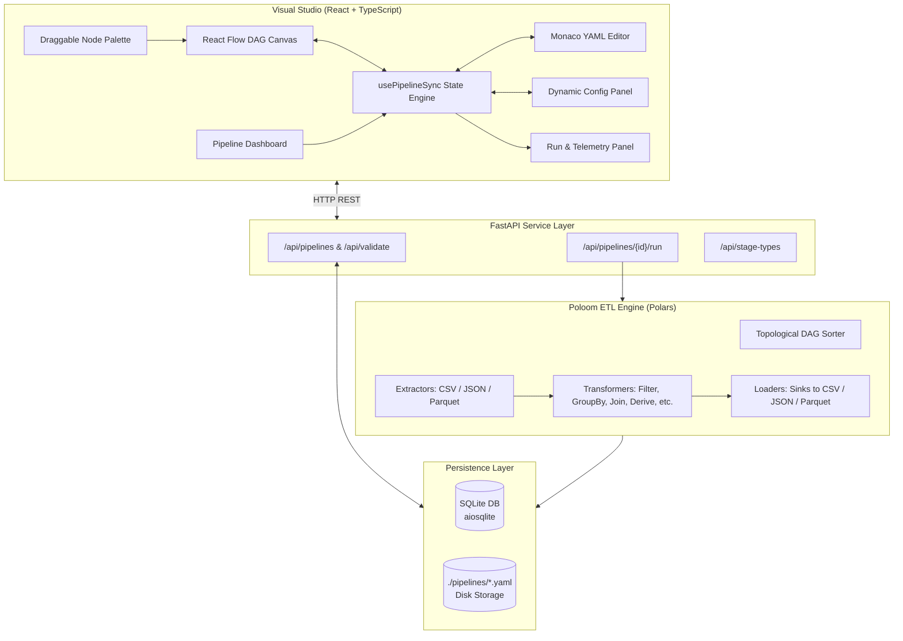

# 🌸 Poloom — Visual YAML-Driven ETL Framework

[](https://python.org)
[](https://fastapi.tiangolo.com)
[](https://pola.rs)
[](https://react.dev)
[](https://reactflow.dev)
[](LICENSE)

> **Poloom** (*Polars* + *Loom* — weaving data paths visually): A fast, declarative ETL studio powered by **Python Polars**, orchestrated via **YAML DAG configurations**, and designed with a modern **React + React Flow visual studio** and **FastAPI** backend with SQLite persistence.

---

## 📑 Table of Contents

- [Overview](#-overview)
- [Key Features](#-key-features)
- [System Architecture](#-system-architecture)
- [Project Structure](#-project-structure)
- [Quick Start](#-quick-start)
  - [Option A: Development Mode (Hot Reloading)](#option-a-development-mode-hot-reloading)
  - [Option B: Unified Mode (FastAPI Serves Frontend SPA)](#option-b-unified-mode-fastapi-serves-frontend-spa)
- [Visual Studio Capabilities](#-visual-studio-capabilities)
- [Reusable Pipeline Variables](#-reusable-pipeline-variables)
- [YAML Pipeline Specification](#-yaml-pipeline-specification)
- [Stage Reference](#-stage-reference)
  - [Extract Stages](#extract-stages)
  - [Transform Operations](#transform-operations)
  - [Load Stages](#load-stages)
- [REST API Reference](#-rest-api-reference)
- [End-to-End Example](#-end-to-end-example)
- [Development & Testing](#-development--testing)
- [Roadmap](#-roadmap)
- [License](#-license)

---

## 🌟 Overview

The name **Poloom** is a portmanteau of **Polars** (the blazing-fast, multi-threaded DataFrame engine) and **Loom** (weaving data paths together visually).

**Poloom** bridges the gap between raw Python ETL scripts, heavy orchestration frameworks, and visual low-code tools. It allows data engineers and developers to design, visualize, and execute complex, multi-stage data processing pipelines purely in **YAML** or via an **interactive visual DAG canvas**.

Under the hood, Poloom uses **Polars `LazyFrame`s** to construct a Directed Acyclic Graph (DAG) of computations. This enables Polars' query optimizer to perform predicate pushdown, projection pushdown, and parallel execution across multi-core systems with minimal memory footprint.

---

## ✨ Key Features

- **⚡ Blazing Fast Polars Engine**: Leverages lazy evaluation and native Rust multithreading for maximum throughput.
- **🎨 Interactive Visual DAG Canvas**: Build pipelines visually with React Flow — drag and drop stages, connect dependencies with animated arrows, and auto-layout with `dagre`.
- **🛠️ Structured Stage Config Inspectors**: Tailored visual forms for every operation — column selector chips, structured condition builders (operators & AND/OR logic), GroupBy aggregations, rename tables, cast dropdowns, derive expressions, and right-stage join selectors.
- **🧩 Reusable Pipeline Variables**: Define global parameters (`${var_name}`) with automatic runtime interpolation across file paths, filter thresholds, derive formulas, and sink filenames.
- **🔄 Live Bidirectional Sync**: Visual flow canvas, Monaco YAML editor, and property inspector forms are always in 100% real-time synchronization.
- **📄 Declarative YAML Pipelines**: Define extract, transform, and load stages cleanly without writing boilerplate Python code.
- **🔀 Automatic DAG Resolution**: Automatically resolves execution order using Kahn's topological sort algorithm, handling branching and joins seamlessly.
- **🛡️ Strict Pydantic Validation**: Instant schema validation with clear error messages before any stage runs.
- **💾 Dual Persistence**: Saves pipelines to both human-readable `.yaml` files on disk and SQLite via `aiosqlite` with full execution history.
- **📊 Real-time Execution Telemetry**: Run pipelines directly from the UI to view stage-by-stage execution latency (in ms), status badges, and rows affected.
- **🌐 RESTful API & Swagger UI**: Full CRUD, validation, execution, and run metrics out of the box.

---

## 🏗️ System Architecture



### Execution Lifecycle

1. **Visual Composition & Sync**: The user constructs or edits the DAG visually; YAML is kept synchronized in real time.
2. **Ingestion & Validation**: Pipeline configuration is parsed and validated against Pydantic schemas.
3. **Graph Analysis**: `depends_on` relationships are evaluated to detect cycles and build a deterministic topological schedule.
4. **Lazy Graph Construction**: Extractors and Transformers produce linked Polars `LazyFrame`s without reading full datasets into memory.
5. **Execution & Materialization**: Load stages trigger `.collect()` or streaming sinks, measuring row counts and stage latency.
6. **Run Telemetry**: Status, duration, errors, and affected rows per stage are persisted to SQLite and displayed in the UI.

---

## 📂 Project Structure

```
poloom/
├── backend/
│   ├── app/
│   │   ├── main.py                 # FastAPI application entry point, CORS, & SPA static host
│   │   ├── engine/
│   │   │   ├── executor.py         # DAG topological sorter & pipeline executor
│   │   │   ├── extractors.py       # Polars readers (CSV, JSON, Parquet)
│   │   │   ├── transformers.py     # Transform operations (filter, group_by, join, derive, etc.)
│   │   │   └── loaders.py          # Data sinks (CSV, JSON, Parquet)
│   │   ├── models/
│   │   │   └── pipeline.py         # Pydantic models & validation schemas
│   │   ├── routers/
│   │   │   └── pipelines.py        # REST API route handlers & stage catalog
│   │   └── services/
│   │       ├── database.py         # SQLite connection manager & table initialization
│   │       └── pipeline_store.py   # CRUD repository & execution history logging
│   ├── sample_data/
│   │   └── customers.csv           # Sample dataset for testing
│   ├── tests/
│   │   └── test_engine.py          # Pytest unit & integration suite
│   ├── pipelines/                  # Stored pipeline YAML files (auto-generated)
│   ├── data/                       # SQLite database file (auto-generated)
│   └── pyproject.toml              # Backend dependencies & metadata
│
├── frontend/
│   ├── src/
│   │   ├── api/
│   │   │   └── client.ts           # Typed fetch client for backend endpoints
│   │   ├── components/
│   │   │   ├── FlowCanvas.tsx      # React Flow interactive DAG canvas
│   │   │   ├── FlowNodes.tsx       # Custom stage nodes with category styling
│   │   │   ├── NodePalette.tsx     # Draggable sidebar palette with stage catalog
│   │   │   ├── PipelineList.tsx    # Dashboard card grid for saved pipelines
│   │   │   ├── RunPanel.tsx        # Save, execution trigger, & telemetry metrics
│   │   │   ├── StageConfigPanel.tsx# Context-aware property inspector form
│   │   │   └── YamlEditor.tsx      # Embedded Monaco YAML editor
│   │   ├── hooks/
│   │   │   └── usePipelineSync.ts  # Bidirectional sync engine (Flow ↔ YAML ↔ Forms)
│   │   ├── types/
│   │   │   └── pipeline.ts         # TypeScript interfaces mirroring Pydantic models
│   │   ├── App.tsx                 # Root application shell & view router
│   │   └── index.css               # Poloom dark-mode modern design system
│   ├── package.json
│   └── vite.config.ts
│
├── IMPLEMENTATION_PLAN.md          # Technical design & milestone tracker
└── README.md
```

---

## 🚀 Quick Start

### Prerequisites

- **Python 3.14+**
- **Node.js 18+** & **npm**
- **Git**

### 1. Clone the Repository

```bash
git clone https://github.com/your-org/poloom.git
cd poloom
```

---

### Option A: Development Mode (Hot Reloading)

#### 1. Setup Backend
```bash
# Create & activate virtual environment
python -m venv .venv
source .venv/bin/activate  # On Windows: .venv\Scripts\Activate.ps1

# Install backend dependencies
cd backend
pip install -e ".[dev]"

# Start FastAPI backend server
uvicorn app.main:app --reload --port 8000
```

#### 2. Setup Frontend
```bash
# In a new terminal:
cd frontend
npm install
npm run dev
```

Open **[http://localhost:5173](http://localhost:5173)** to launch the visual studio.

---

### Option B: Unified Mode (FastAPI Serves Frontend SPA)

Build the production frontend bundle, and FastAPI will serve both API routes and the visual UI on port 8000:

```bash
# 1. Build Frontend
cd frontend
npm install
npm run build

# 2. Start FastAPI (serves API on /api/* and frontend on /)
cd ../backend
pip install -e .
uvicorn app.main:app --port 8000
```

Open **[http://localhost:8000](http://localhost:8000)** directly in your browser.

- **Interactive Swagger Docs**: [http://localhost:8000/docs](http://localhost:8000/docs)
- **ReDoc Alternative**: [http://localhost:8000/redoc](http://localhost:8000/redoc)

---

## 🎨 Visual Studio Capabilities

| Capability | Description |
| :--- | :--- |
| **Node Palette** | Categorized sidebar containing all Extract, Transform, and Load templates with icons. Drag and drop onto the canvas to add stages. |
| **Visual Flow Canvas** | Interactive graph canvas built with React Flow, supporting stage dragging, custom node cards, and animated connection handles. |
| **Auto-Layout** | Automatically arranges complex DAGs into clean top-to-bottom structures using Kahn's topological and `dagre` graph algorithms. |
| **Monaco YAML Studio** | Full syntax-highlighted YAML editor with real-time bidirectional syncing. Edits in code update the visual canvas instantly and vice versa. |
| **Dynamic Form Inspector** | Select any node to configure parameters (paths, columns, operators, group keys, JSON configs) through tailored form fields. |
| **Run & Telemetry Panel** | Trigger executions with one click and observe per-stage duration (ms), row throughput, and detailed error tracebacks. |
| **Dashboard Manager** | Browse, open, and delete saved pipelines with execution history summaries. |

---

## 📝 YAML Pipeline Specification

A Poloom pipeline is defined by top-level metadata and a list of interconnected stages:

```yaml
pipeline:
  name: customer_metrics_pipeline
  description: "Filter active customers and aggregate revenue by region"
  version: "1.0"

stages:
  - id: load_customers
    type: extract
    source: csv
    extract_config:
      path: "./sample_data/customers.csv"
      separator: ","
      has_header: true

  - id: filter_active_customers
    type: transform
    operation: filter
    depends_on:
      - load_customers
    transform_config:
      logic: and
      conditions:
        - field: status
          operator: eq
          value: active
        - field: revenue
          operator: gte
          value: 5000

  - id: compute_tax_and_margin
    type: transform
    operation: derive
    depends_on:
      - filter_active_customers
    transform_config:
      columns:
        tax_amount: "col('revenue') * 0.18"
        net_revenue: "col('revenue') * 0.82"

  - id: aggregate_by_region
    type: transform
    operation: group_by
    depends_on:
      - compute_tax_and_margin
    transform_config:
      group_by:
        - region
      aggregations:
        - column: net_revenue
          function: sum
          alias: total_net_revenue
        - column: id
          function: count
          alias: active_customer_count

  - id: export_parquet
    type: load
    sink: parquet
    depends_on:
      - aggregate_by_region
    load_config:
      path: "./output/regional_summary.parquet"
      compression: snappy
```

---

## 🧩 Reusable Pipeline Variables

Poloom allows defining global pipeline variables that can be referenced across multiple stages in paths, filter thresholds, expressions, and parameters using the `${variable_name}` syntax.

```yaml
pipeline:
  name: regional_filtered_sync
  variables:
    active_region: "North"
    min_revenue: 7500
    tax_rate: 0.18
    data_dir: "./sample_data"

stages:
  - id: extract_csv
    type: extract
    source: csv
    extract_config:
      path: "${data_dir}/customers.csv"

  - id: filter_region
    type: transform
    operation: filter
    depends_on: [extract_csv]
    transform_config:
      conditions:
        - field: region
          operator: eq
          value: "${active_region}"
        - field: revenue
          operator: gte
          value: "${min_revenue}"

  - id: compute_tax
    type: transform
    operation: derive
    depends_on: [filter_region]
    transform_config:
      columns:
        tax_amount: "col('revenue') * ${tax_rate}"
```

The variables are managed in the UI via the **Variables Tab**, which includes type casting (String, Number, Boolean, JSON) and one-click placeholder copying.

---

## 📖 Stage Reference

### Extract Stages

Extract stages read source files into Polars `LazyFrame`s.

| Source | Parameters | Description |
| :--- | :--- | :--- |
| `csv` | `path` *(str, req)*<br>`separator` *(str, default: `,`)*<br>`has_header` *(bool, default: `true`)*<br>`dtypes` *(dict, opt)*<br>`n_rows` *(int, opt)* | Read delimited text files with type inference or explicit dtype mapping. |
| `json` | `path` *(str, req)*<br>`n_rows` *(int, opt)* | Read JSON structured arrays or lines into a LazyFrame. |
| `parquet` | `path` *(str, req)*<br>`n_rows` *(int, opt)* | Lazy scan over Parquet columnar files with zero-copy reading. |

---

### Transform Operations

Transformers manipulate datasets in-memory lazily.

#### 1. `filter`
Filters rows according to one or more conditions combined with `and` / `or`.
```yaml
operation: filter
transform_config:
  logic: and # "and" | "or"
  conditions:
    - field: age
      operator: gte # eq, ne, gt, gte, lt, lte, in, not_in, is_null, is_not_null, contains, starts_with, ends_with
      value: 21
```

#### 2. `select`
Projects a subset of columns.
```yaml
operation: select
transform_config:
  columns: ["id", "name", "email", "revenue"]
```

#### 3. `rename`
Renames columns using a key-value mapping.
```yaml
operation: rename
transform_config:
  mapping:
    signup_date: registered_at
    revenue: gross_revenue
```

#### 4. `group_by`
Aggregates data over grouping keys.
```yaml
operation: group_by
transform_config:
  group_by: ["region", "status"]
  aggregations:
    - column: revenue
      function: sum # sum, mean, count, min, max, first, last
      alias: total_revenue
```

#### 5. `sort`
Sorts rows by one or more columns.
```yaml
operation: sort
transform_config:
  by: ["revenue", "signup_date"]
  descending: true # or boolean array: [true, false]
```

#### 6. `cast`
Casts column types (supported: `Int8`, `Int16`, `Int32`, `Int64`, `UInt8`, `UInt16`, `UInt32`, `UInt64`, `Float32`, `Float64`, `Utf8`, `String`, `Boolean`, `Date`, `Datetime`).
```yaml
operation: cast
transform_config:
  mapping:
    revenue: Float64
    id: Int64
```

#### 7. `derive`
Evaluates safe Polars expressions to add computed columns (`col`, `lit`, `when` supported).
```yaml
operation: derive
transform_config:
  columns:
    discounted_price: "col('revenue') * 0.9"
    high_value_flag: "when(col('revenue') > 10000).then(lit(True)).otherwise(lit(False))"
```

#### 8. `drop_nulls`
Removes rows containing nulls across all or selected columns.
```yaml
operation: drop_nulls
transform_config:
  subset: ["email", "revenue"] # optional
```

#### 9. `unique`
Deduplicates records based on column subsets.
```yaml
operation: unique
transform_config:
  subset: ["email"]
  keep: first # first | last | any | none
```

#### 10. `join`
Combines with another upstream stage in the DAG.
```yaml
operation: join
transform_config:
  right_stage: orders_extract
  on: ["customer_id"] # or left_on / right_on
  how: inner # inner | left | right | outer | cross
```

---

### Load Stages

Load stages materialize LazyFrames and output them to the target storage format.

| Sink | Parameters | Description |
| :--- | :--- | :--- |
| `csv` | `path` *(str, req)*<br>`separator` *(str, default: `,`)* | Exports results to a CSV file. |
| `json` | `path` *(str, req)* | Exports results to a JSON file. |
| `parquet` | `path` *(str, req)*<br>`compression` *(str: `snappy`, `gzip`, `lz4`, `zstd`, `none`)* | Exports results to an optimized columnar Parquet file. |

---

## 🔌 REST API Reference

| Method | Endpoint | Description |
| :--- | :--- | :--- |
| `GET` | `/api/stage-types` | Retrieve catalog of all stage types, icons, and input schemas |
| `GET` | `/api/pipelines` | List all saved pipelines with latest run status |
| `GET` | `/api/pipelines/{id}` | Retrieve pipeline configuration and raw YAML |
| `POST` | `/api/pipelines` | Create a new pipeline (accepts JSON object or raw `yaml_config` string) |
| `PUT` | `/api/pipelines/{id}` | Update an existing pipeline |
| `DELETE` | `/api/pipelines/{id}` | Delete pipeline from database and disk |
| `POST` | `/api/pipelines/{id}/run` | Execute pipeline DAG and return execution metrics |
| `GET` | `/api/pipelines/{id}/runs` | Retrieve execution run history and stage duration breakdown |
| `POST` | `/api/validate` | Validate YAML pipeline structure without persisting |

---

## 💡 End-to-End Example

### 1. Validate YAML Configuration

```bash
curl -X POST http://localhost:8000/api/validate \
  -H "Content-Type: application/json" \
  -d '{
    "yaml_config": "pipeline:\n  name: test\nstages:\n  - id: src\n    type: extract\n    source: csv\n    extract_config:\n      path: ./sample_data/customers.csv"
  }'
```

**Response:**
```json
{
  "valid": true,
  "pipeline_name": "test",
  "stage_count": 1
}
```

### 2. Create and Save Pipeline

```bash
curl -X POST http://localhost:8000/api/pipelines \
  -H "Content-Type: application/json" \
  -d '{
    "pipeline": {
      "name": "customer_revenue_summary",
      "description": "Regional revenue breakdown for active customers"
    },
    "stages": [
      {
        "id": "extract_csv",
        "type": "extract",
        "source": "csv",
        "extract_config": {
          "path": "./sample_data/customers.csv"
        }
      },
      {
        "id": "filter_active",
        "type": "transform",
        "operation": "filter",
        "depends_on": ["extract_csv"],
        "transform_config": {
          "conditions": [
            {"field": "status", "operator": "eq", "value": "active"}
          ]
        }
      },
      {
        "id": "group_by_region",
        "type": "transform",
        "operation": "group_by",
        "depends_on": ["filter_active"],
        "transform_config": {
          "group_by": ["region"],
          "aggregations": [
            {"column": "revenue", "function": "sum", "alias": "total_revenue"},
            {"column": "id", "function": "count", "alias": "customer_count"}
          ]
        }
      },
      {
        "id": "save_csv",
        "type": "load",
        "sink": "csv",
        "depends_on": ["group_by_region"],
        "load_config": {
          "path": "./output/revenue_by_region.csv"
        }
      }
    ]
  }'
```

**Response:**
```json
{
  "id": "a1b2c3d4e5f6",
  "message": "Pipeline created successfully"
}
```

### 3. Run Pipeline

```bash
curl -X POST http://localhost:8000/api/pipelines/a1b2c3d4e5f6/run
```

**Response:**
```json
{
  "pipeline_id": "a1b2c3d4e5f6",
  "pipeline_name": "customer_revenue_summary",
  "status": "success",
  "total_duration_ms": 14.82,
  "stage_results": [
    {
      "stage_id": "extract_csv",
      "status": "success",
      "rows_affected": 0,
      "duration_ms": 1.25,
      "error": null
    },
    {
      "stage_id": "filter_active",
      "status": "success",
      "rows_affected": 0,
      "duration_ms": 0.84,
      "error": null
    },
    {
      "stage_id": "group_by_region",
      "status": "success",
      "rows_affected": 0,
      "duration_ms": 1.10,
      "error": null
    },
    {
      "stage_id": "save_csv",
      "status": "success",
      "rows_affected": 4,
      "duration_ms": 11.50,
      "error": null
    }
  ],
  "error": null
}
```

---

## 🧪 Development & Testing

### Running Tests

```bash
# Backend pytest suite
cd backend
pytest -v

# Frontend TypeScript check & build verification
cd frontend
npm run build
```

---

## 🗺️ Roadmap

- [x] High-performance Polars LazyFrame execution engine
- [x] Directed Acyclic Graph (DAG) topological execution with Kahn's algorithm
- [x] Full YAML & JSON pipeline specifications
- [x] Multi-source extracts (CSV, JSON, Parquet) and sinks
- [x] 10+ core transform operations (Filter, Group By, Join, Derive, Cast, etc.)
- [x] SQLite pipeline storage & run execution history
- [x] **Interactive Visual Flow Studio**: React Flow drag-and-drop canvas with live connection routing
- [x] **Dual-Pane Monaco Editor**: Live bidirectional YAML synchronization with canvas and form inputs
- [x] **Execution & Telemetry Panel**: Per-stage execution duration breakdown and status indicators
- [ ] **Data Preview Table**: Live intermediate dataset previews at each DAG node
- [ ] **Cloud Storage Connectors**: AWS S3, Google Cloud Storage, Azure Blob, and Delta Lake sinks
- [ ] **Scheduled & Event Triggers**: Built-in cron / webhook pipeline triggers

---

## 📄 License

This project is licensed under the [MIT License](LICENSE).
